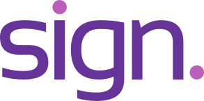

<div align="center">
  

  # SignAI
  
  **Bidirectional Sign Language Translation powered by AI**

  [](LICENSE.md)
  [](https://angular.dev/)
</div>

<br />

SignAI is an innovative open-source application designed to bridge the communication gap between the Deaf and hearing communities. It supports bidirectional translation: from spoken/written languages to animated 3D sign language avatars, and from real-time camera-input sign language into text and speech.

## ✨ Key Features

- **🌐 Bidirectional Translation:** Translate from text/voice to sign language, and from sign language (via camera) to text/voice.
- **🗣️ Multilingual Support:** Supports over 40+ spoken and signed languages.
- **📷 Real-Time Camera Inference:** Employs cutting-edge pose estimation models to detect signs live from your webcam.
- **🤖 3D Avatar Rendering:** Photo-realistic 3D human avatars and simplified skeletons visualize sign language gracefully.
- **✈️ Offline Mode:** Download models to your browser to perform translations locally without an internet connection.
- **📱 Responsive UI:** Fully mobile-responsive Progressive Web App (PWA) with light and dark themes.

## 🛠️ Technology Stack

- **Framework:** Angular 21 (with Server-Side Rendering)
- **Machine Learning:** TensorFlow.js, MediaPipe (Holistic & Pose Estimation)
- **Rendering:** Three.js, Google Model Viewer
- **Styling:** SCSS, Ionic UI Components

## 🚀 Getting Started

Follow these steps to set up the project locally on your machine.

### Prerequisites

- [Node.js](https://nodejs.org/) (Version >= 18)
- npm (Version >= 9)

### 1. Clone the repository

```bash
git clone git@github.com:NityaDubeyyy/SignAI.git
cd SignAI
```

### 2. Install Dependencies

```bash
npm install
```

### 3. Start the Local Server

Run the local development server:

```bash
npm start
```

Once the server is running, open [http://localhost:4200/](http://localhost:4200/) in your web browser. The app will automatically hot-reload if you make changes to the code.

## 📦 Build & Test

### Build for Production
To build a production-optimized version of the application:
```bash
npm run build
```

### Running Tests
To run unit and integration tests:
```bash
npm test
```

## 🤝 Contributing

Contributions are always welcome! Whether it's adding new sign languages, optimizing the machine learning models, or improving the UI, your help makes a difference.

1. Fork the Project
2. Create your Feature Branch (`git checkout -b feature/AmazingFeature`)
3. Commit your Changes (`git commit -m 'Add some AmazingFeature'`)
4. Push to the Branch (`git push origin feature/AmazingFeature`)
5. Open a Pull Request

## 📄 License

This project is open-source. Please see the [LICENSE.md](LICENSE.md) file for details.
